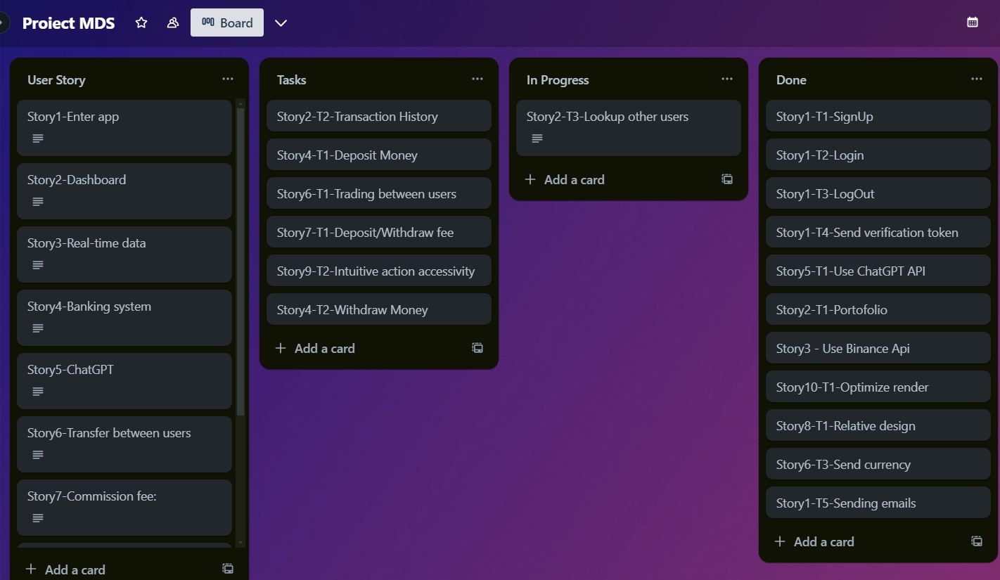
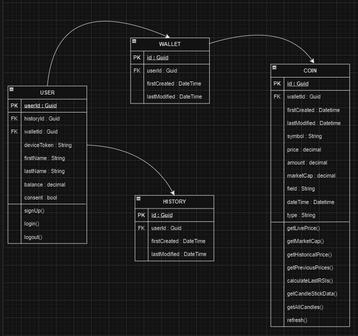
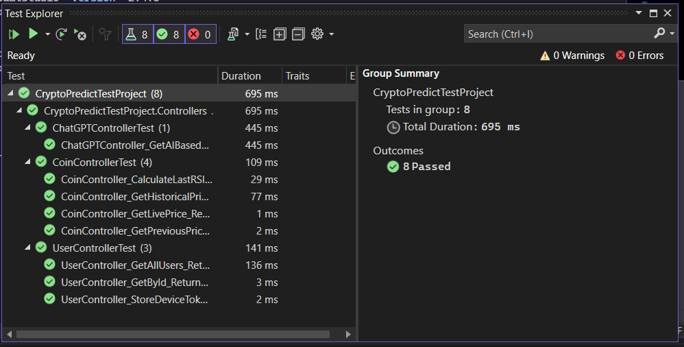
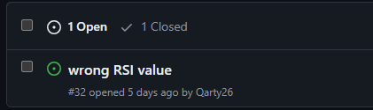
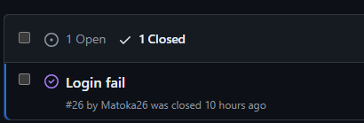
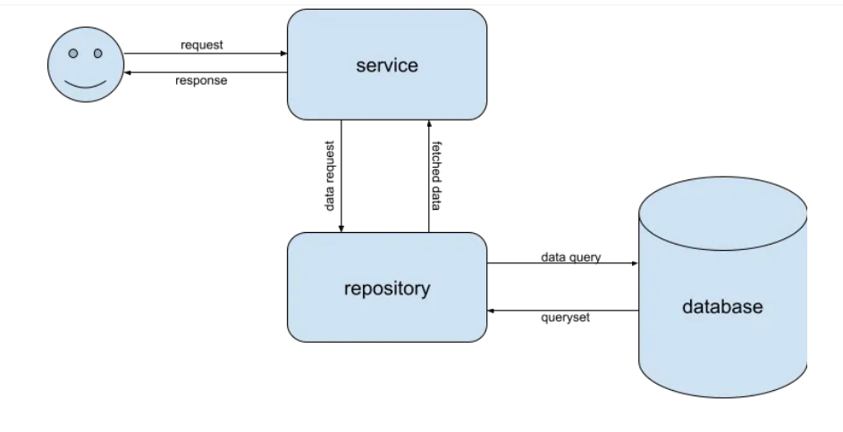
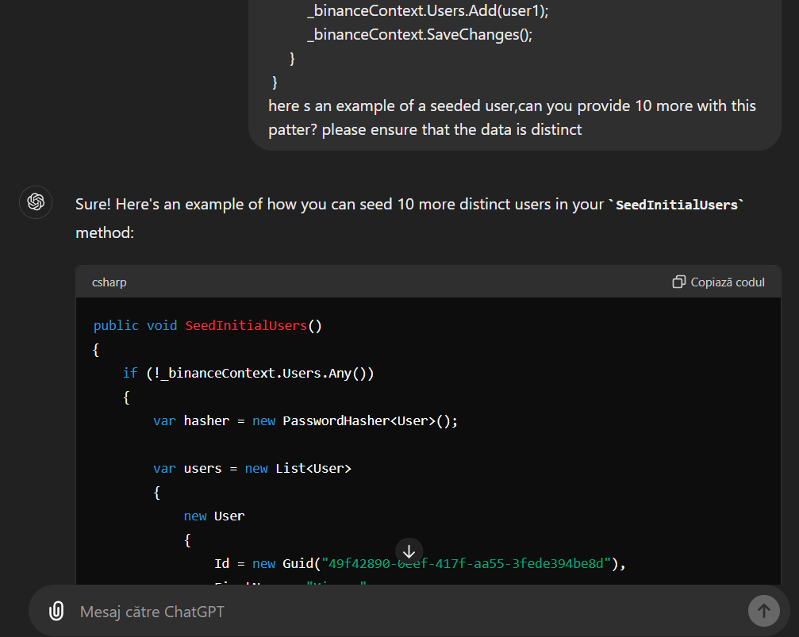

# Crypto-Exchange App
## [Live Demo](https://www.youtube.com/watch?v=V098p5Q4zmc&ab_channel=AndreiAlexandru)

The Crypto-Exchange APP is a robust ASP.NET application designed to manage and forecast the prices of various cryptocurrencies. It offers real-time price tracking, historical data analysis, and trend visualization, providing users with valuable market insights. By using advanced statistics and AI, the app predicts future price movements, helping traders and investors make smart decisions. With its intuitive interface and comprehensive data management capabilities, this tool is ideal for anyone looking to effectively navigate the cryptocurrency market.


## 1. User stories:  
### Backend
1. <b>Enter app:</b> 
As a user, I should be able sign up or to securely log in to the platform using my email and password and log out. 

2. <b>Dashboard:</b> 
As a user, I should have access to my personalized dashboard, where I can view my cryptocurrency holdings, portfolio performance metrics, and recent transactions.

3. <b>Real-time data:</b> 
The platform should fetch real-time market data from cryptocurrency exchanges and display it on the dashboard, including current prices and volume for selected cryptocurrencies.

4. <b>Banking system:</b> 
As a user, I should be able to deposit and withdraw money from balance.

5. <b>ChatGPT:</b> 
As a user, I should be able to request informations from ChatGPT API regarding predictions of a chosen currency.

6. <b>Commission fee:</b> 
As a user, there will be a commission fee applied when withdrawing and depositing money from my account.

### Frontend

7. <b>Responsiveness:</b> 
As a user, I want to use a web application that is responsive and adapts to different screen sizes So that I can access the application seamlessly from any device.

8. <b>Clean interface</b> 
As a user,I want the frontend to have an appealing design and intuitive user interface,
So that I can easily navigate the application and have a pleasant experience while interacting with it.

9. <b>Quick render:</b> 
As a user, I want the application to respond rapidly to my requests for data retrieval, analysis, and transactions,
So that I can make timely decisions and take actions without experiencing delays or interruptions.  

10. <b>Coins info</b>  
As a user, I want to see informations about crypto currencies 
of my interest, such as graphs of price fluctuation

## 2. Backlog Creation:
> [!NOTE]
> The snip is during the delevopment phase!, 
> It's not up to date!


1. <b>Enter app:</b> 
    - [x] SignUp 
    - [x] LogIn 
    - [x] LogOut
    - [x] Send verification token
    - [x] Sending email

2. <b>Dashboard:</b>
    - [x] Portofolio
    - [ ] Transactions History
    - [ ] Lookup other users
 
3. <b>Real-time data:</b>
    - [x] Use [Binance API](https://binance-docs.github.io/apidocs/spot/en/#introduction)

4. <b>Banking system:</b>
    - [ ] Deposit money
    - [ ] Withdraw money

5. <b>ChatGPT:</b>
    - [x] Use [ChatGPT API](https://platform.openai.com/docs/guides/text-generation) 

6. <b>Transfer between users:</b>
    - [ ] Trading with other users

7. <b>Responsiveness:</b>
    - [x] Design it relative to the view port

8. <b>Clean interface:</b> 
    - [x] Make the buttons as accessible as possible and intuitive
    - [x] Design app logo

9. <b>Display charts</b>
    - [x] Candle Sticks
    - [x] Disk

10. <b>Profile Page</b>
    - [x] Display user info on a personal page 

## 3. UML Diagram



## 4. Workflow Diagram
[TODO adauga diagrama]

## 5. Source Control

### [View all commits/merges/pull requests](https://github.com/Matoka26/Crypto-Exchange/commits/main/)
### [View all branches](https://github.com/Matoka26/Crypto-Exchange/branches)
### [View contributors](https://github.com/Matoka26/Crypto-Exchange/graphs/contributors)


## 6. Unit Test Automation

Done using [FakeItEasy](https://fakeiteasy.github.io/) & [Fluent Assertions](https://fluentassertions.com/)  

Tests:  
- User: 
    - StoreDeviceToken
    - GetById
    - GetAllUsers
- Coin:
    - GetLivePrice
    - CalculateLastRSIs
    - GetHistoricalPrice
    - GetPreviousPrices
- ChatGPT
    - GetAIBasedResult

Results:  


## 7. Bug Reports



## 8. Code Comments
> [!NOTE]
> This code is written to be clean and self-explanatory. Minimal comments are added for clarity where needed.

Example:
```
[HttpPost]
        public async Task<IActionResult> GetAIBasedResult(string searchText, int maxTokens)
        {
            /* Takes a prompt and a number of tokens and sends a request to OpenAI API */
            try
            {   
                // Connection key for OpenAI API
                var apiKey = Configuration["ApiKeys:OpenAIKey"];

                string answer = string.Empty;

                var openai = new OpenAIAPI(apiKey);
                CompletionRequest completion = new CompletionRequest();
                
                // Fill Fields for query
                completion.Prompt = searchText;                                      // text to search
                completion.Model = OpenAI_API.Models.Model.ChatGPTTurboInstruct;     // model to ask
                completion.MaxTokens = maxTokens;                                    // max tokens of a batch(depending on model)

                // Search for result
                var result = await openai.Completions.CreateCompletionsAsync(completion);
                foreach (var item in result.Completions)
                {
                    answer += item.Text;
                }

                return Ok(result);
            }catch (Exception ex)
            {
                return BadRequest(ex.Message);
            }
        }
```

## 9. Design Patterns
### [Repository-Service Pattern](https://medium.com/@ankitpal181/service-repository-pattern-802540254019)

#### Directory Structure
```
Backend
|--Controllers
|       |-UserController.cs
|       |-CoinController.cs
|       ...
|
|--Repositories
|       |-GenericRepository
|              |-IGenericRepository.cs
|              |-GenericRepository.cs
|       |-UserRepository               
|              |-IUserRepository.cs
|              |-UserRepository.cs
|       ...
|--Services
|       |-UserService
|              |-IUserService.cs
|              |-UserService.cs
|       |-CoinService
|              |-ICoinService.cs
|              |-CoinService.cs
|       ...
|--Data
|--Helpers   
|--Migration
...
|-Program.cs

```

```
// GenericRepository DB connection

protected readonly BinanceContext _binanceContext;
protected readonly DbSet<TEntity> _table;

public GenericRepository(BinanceContext binanceContext)
    {
        _binanceContext = binanceContext;
        _table = _binanceContext.Set<TEntity>();
    }
```

```
// Interface Generic Repository

public interface IGenericRepository<TEntity> where TEntity : BaseEntity
    {
        //get all
        List<TEntity> GetAll();
        Task<List<TEntity>> GetAllAsync();

        //create
        void Create(TEntity entity);
        Task CreateAsync(TEntity entity);
        void CreateRange(IEnumerable<TEntity> entitites);
        Task CreateRangeAsync(IEnumerable<TEntity> entitites);

        //update
        void Update(TEntity entity);
        void UpdateRange(IEnumerable<TEntity> entitites);

        //delete
        void Delete(TEntity entity);
        bool DeleteById(Guid id);
        void DeleteRange(IEnumerable<TEntity> entitites);

        //find
        TEntity FindById(Guid id);
        Task<TEntity> FindByIdAsync(Guid id);

        //save
        bool Save();
        Task<bool> SaveAsync();
    }
```
#### Usage Example
```
// User Service 

 public class UserService : IUserService
 {

     private readonly IUserRepository _userRepository;
     private readonly IMapper _mapper;
     private readonly UserManager<User> _userManager;
     private readonly SignInManager<User> _signInManager;
     //will be used for smtp 
     private readonly IConfiguration _configuration;
     //for verif token
     private readonly IEmailService _emailService;

     public UserService(IUserRepository userRepository, IMapper mapper, UserManager<User> userManager, SignInManager<User> signInManager, IConfiguration configuration, IEmailService emailService)
     {
         _userRepository = userRepository;
         _mapper = mapper;
         _userManager = userManager;
         _signInManager = signInManager;
         _configuration = configuration;
         _emailService = emailService;
     }
    public async Task<UserDTO> CreateAsync(UserCreateDTO user)
        {
            var newUser = _mapper.Map<User>(user);
            await _userRepository.CreateAsync(newUser);
            return _mapper.Map<UserDTO>(newUser);
        }
    ...
 }
```

## 10. Integration of AI tools
OpenAI API has been utilized for predicting the future prices of the market

```
 [HttpPost]
    public async Task<string> GetAIBasedResult(string searchText, int maxTokens)
        {
            try
            {
                // Connection key for OpenAI API
                var apiKey = Configuration["ApiKeys:OpenAIKey"];

                string answer = string.Empty;

                var openai = new OpenAIAPI(apiKey);
                CompletionRequest completion = new CompletionRequest
                {
                    Prompt = searchText,                                      // text to search
                    Model = OpenAI_API.Models.Model.ChatGPTTurboInstruct,     // model to ask
                    MaxTokens = maxTokens                                     // max tokens of a batch (depending on model)
                };

                // Search for result
                var result = await openai.Completions.CreateCompletionsAsync(completion);
                if (result.Completions.Count > 0)
                {
                    // Get the first completion's text
                    answer = result.Completions[0].Text.Trim();
                }

                return answer;
            }
            catch (Exception ex)
            {
                return "";
            }
        }
```

## 11. AI tools usage
AI tools have been utilized to enhance various aspects of the software development process. AI has been employed to improve code quality, automate repetitive tasks, and facilitate efficient debugging and testing.


#### Code snip:
```
public void SeedInitialUsers()
{
    if (!_binanceContext.Users.Any())
    {
        var hasher = new PasswordHasher<User>();

        var users = new List<User>
        {
            new User
            {
                Id = new Guid("b7f3030a-6d61-4f8c-b709-dc93f0e9380b"),
                FirstName = "John",
                LastName = "Doe",
                UserName = "JohnDoe1",
                NormalizedUserName = "JOHNDOE1",
                Email = "john.doe@example.com",
                EmailConfirmed = true,
                PasswordHash = hasher.HashPassword(null, "johnpassword"),
                SecurityStamp = Guid.NewGuid().ToString(),
            },
            new User
            {
                Id = new Guid("a1f3040b-6d61-4f8c-b709-dc93f0e9380b"),
                FirstName = "Jane",
                LastName = "Smith",
                UserName = "JaneSmith",
                NormalizedUserName = "JANESMITH",
                Email = "jane.smith@example.com",
                EmailConfirmed = true,
                PasswordHash = hasher.HashPassword(null, "janepassword"),
                SecurityStamp = Guid.NewGuid().ToString(),
            },
            new User
            {
                Id = new Guid("b2e42890-0eef-417f-aa55-3fede394be8d"),
                FirstName = "Alice",
                LastName = "Johnson",
                UserName = "AliceJ",
                NormalizedUserName = "ALICEJ",
                Email = "alice.j@example.com",
                EmailConfirmed = true,
                PasswordHash = hasher.HashPassword(null, "alicepassword"),
                SecurityStamp = Guid.NewGuid().ToString(),
            },

            .......
        
        };

        _binanceContext.Users.AddRange(users);
        _binanceContext.SaveChanges();
    }
}
```


## 12. Refactoring, code standards

#### Initial:
```
    public async Task<UserDTO> Update(UserUpdateDTO user)
        {
            var existingUser = await _userRepository.GetUserById(user.Id);

            if (existingUser == null)
            {
                throw new Exception("User not found");
            }

            var hasher = new PasswordHasher<User>();
            if (user.UserName != null) existingUser.UserName = user.UserName;
            if (user.FirstName != null) existingUser.FirstName = user.FirstName;
            if (user.LastName != null) existingUser.LastName = user.LastName;
            if (user.Email != null) existingUser.Email = user.Email;
            if (user.Password != null) existingUser.PasswordHash = hasher.HashPassword(null, user.Password);

            await _userRepository.Update(existingUser);
            return _mapper.Map<UserDTO>(existingUser);
        }
```

#### After refactor:
```
    public async Task<UserDTO> Update(UserUpdateDTO user)
        {
            // Validate the user DTO
            if (user == null) throw new ArgumentNullException(nameof(user));
            if (user.Id == Guid.Empty) throw new ArgumentException("User ID cannot be empty", nameof(user.Id));

            var existingUser = await _userRepository.GetUserById(user.Id);

            if (existingUser == null)
            {
                throw new Exception("User not found");
            }

            UpdateUserFields(existingUser, user);

            await _userRepository.Update(existingUser);
            return _mapper.Map<UserDTO>(existingUser);
        }
    private void UpdateUserFields(User existingUser, UserUpdateDTO user)
        {
            if (!string.IsNullOrWhiteSpace(user.UserName)) existingUser.UserName = user.UserName;
            if (!string.IsNullOrWhiteSpace(user.FirstName)) existingUser.FirstName = user.FirstName;
            if (!string.IsNullOrWhiteSpace(user.LastName)) existingUser.LastName = user.LastName;
            if (!string.IsNullOrWhiteSpace(user.Email)) existingUser.Email = user.Email;
            if (!string.IsNullOrWhiteSpace(user.Password))
            {
                var hasher = new PasswordHasher<User>();
                existingUser.PasswordHash = hasher.HashPassword(existingUser, user.Password);
            }
        }
```